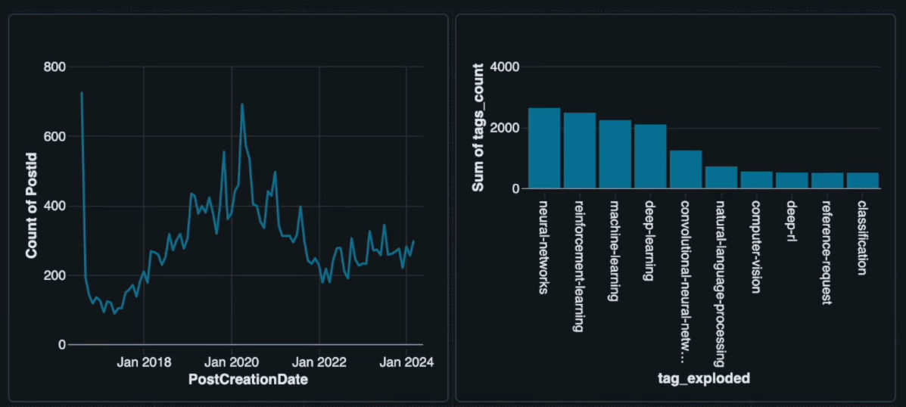

# Stack Exchange Lakehouse-Spark

A modern lakehouse implementation using medallion architecture for processing Stack Exchange data with PySpark and Delta Lake.

## Project Architecture

This project implements a **lakehouse architecture** with **medallion data layers** (Bronze → Silver → Gold) for Stack Exchange data processing:

```
                    Stack Exchange Lakehouse-Spark Architecture

┌─────────────────────────────────────────────────────────────────────────────┐
│                              DATA SOURCES                                  │
├─────────────────────────────────────────────────────────────────────────────┤
│                        Posts.xml      Users.xml                            │
└─────────────────────┬───────────────────────────┬───────────────────────────┘
                      │                           │
                      ▼                           ▼
┌─────────────────────────────────────────────────────────────────────────────┐
│                    BRONZE LAYER (Raw Data - Lakehouse)                     │
├─────────────────────────────────────────────────────────────────────────────┤
│  ┌─────────────────┐     ┌─────────────────┐     ┌─────────────────┐        │
│  │ bronze_post.py  │     │bronze_users.py │     │bronze_post_gx.py│        │
│  │                 │     │                 │     │ (Great Expect.) │        │
│  └─────────┬───────┘     └─────────┬───────┘     └─────────────────┘        │
│            │                       │                      │                 │
│            ▼                       ▼                      ▼                 │
│  ┌─────────────────┐     ┌─────────────────┐     ┌─────────────────┐        │
│  │   raw_posts     │     │   raw_users     │     │ Data Quality    │        │
│  │   (Parquet)     │     │   (Parquet)     │     │   Reports       │        │
│  └─────────────────┘     └─────────────────┘     └─────────────────┘        │
└─────────────────────┬───────────────────────────────────────────────────────┘
                      │
                      ▼
┌─────────────────────────────────────────────────────────────────────────────┐
│                   SILVER LAYER (Curated Data - Delta Lake)                 │
├─────────────────────────────────────────────────────────────────────────────┤
│                    ┌─────────────────────────────┐                          │
│                    │     silver_post.py          │                          │
│                    │  • Tag splitting            │                          │
│                    │  • Column renaming          │                          │
│                    │  • Post type mapping        │                          │
│                    │  • Delta Lake upserts       │                          │
│                    │  • ACID transactions        │                          │
│                    │  • Schema evolution         │                          │
│                    └─────────────┬───────────────┘                          │
│                                  │                                          │
│                                  ▼                                          │
│                    ┌─────────────────────────────┐                          │
│                    │       stg_posts             │                          │
│                    │     (Delta Lake)            │                          │
│                    └─────────────────────────────┘                          │
└─────────────────────────────────┬───────────────────────────────────────────┘
                                  │
                                  ▼
┌─────────────────────────────────────────────────────────────────────────────┐
│                  GOLD LAYER (Analytics - Lakehouse Marts)                  │
├─────────────────────────────────────────────────────────────────────────────┤
│  ┌─────────────────────────┐            ┌─────────────────────────┐          │
│  │gold_most_popular_tags.py│            │  gold_post_users.py     │          │
│  │ • Tag popularity        │            │ • Posts-Users OBT       │          │
│  │ • Ranking analysis      │            │ • User demographics     │          │
│  └─────────┬───────────────┘            └─────────┬───────────────┘          │
│            │                                      │                        │
│            ▼                                      ▼                        │
│  ┌─────────────────────────┐            ┌─────────────────────────┐          │
│  │   marts_top_tags        │            │  marts_posts_users      │          │
│  │     (Parquet)           │            │     (Parquet)           │          │
│  └─────────────────────────┘            └─────────────────────────┘          │
└─────────────────┬─────────────────────────────────┬───────────────────────────┘
                  │                                 │
                  └─────────────────┬───────────────┘
                                    │
                                    ▼
┌─────────────────────────────────────────────────────────────────────────────┐
│                    ANALYTICS LAYER (BI & Visualization)                    │
├─────────────────────────────────────────────────────────────────────────────┤
│                      ┌─────────────────────────────┐                        │
│                      │      Apache Superset       │                        │
│                      │                             │                        │
│                      │  • Interactive Dashboards  │                        │
│                      │  • Tag Popularity Charts   │                        │
│                      │  • User Activity Metrics   │                        │
│                      │  • Real-time Analytics     │                        │
│                      └─────────────────────────────┘                        │
└─────────────────────────────────────────────────────────────────────────────┘

                          Lakehouse-Spark Data Flow Direction: ↓
```

### Bronze Layer (Raw Data - Object Storage)

- **Purpose**: Raw data ingestion in lakehouse format without transformations
- **Storage**: Cloud-native object storage with Parquet format
- **Files**:
  - `bronze_post.ipynb` - Loads post data from XML
  - `bronze_users.ipynb` - Loads user data from XML
  - `bronze_post_gx.ipynb` - Data quality validation with Great Expectations
- **Format**: Parquet (columnar storage for analytics)
- **Tables**: `raw_posts`, `raw_users`

### Silver Layer (Curated Data - Delta Lake)

- **Purpose**: Data cleaning, normalization and standardization with ACID guarantees
- **Storage**: Delta Lake with transaction log and time travel capabilities
- **Files**: `silver_post.ipynb`
- **Lakehouse Features**:
  - ACID transactions for data reliability
  - Schema evolution and enforcement
  - Time travel for data versioning
  - Incremental upserts and merge operations
- **Transformations**:
  - Tag splitting into arrays
  - Column renaming
  - Post type mapping
  - Delta Lake implementation with incremental upserts
- **Format**: Delta Lake (Parquet + transaction log)
- **Tables**: `stg_posts`

### Gold Layer (Analytics - Lakehouse Marts)

- **Purpose**: Business aggregations and analytics-ready datasets
- **Storage**: Optimized for analytical workloads and BI tools
- **Files**:
  - `gold_most_popular_tags.ipynb` - Most popular tags analysis
  - `gold_post_users.ipynb` - Posts and users join
- **Lakehouse Benefits**:
  - Single source of truth for analytics
  - Direct connectivity to BI tools
  - Performance optimized for queries
- **Tables**: `marts_top_tags`, `marts_posts_users`

### Visualization Layer

- **Purpose**: Interactive dashboards and analytics
- **Platform**: Apache Superset
- **Data Sources**: Gold layer tables (marts_top_tags, marts_posts_users)
- **Features**:
  - Real-time dashboards for tag popularity trends
  - User engagement metrics and KPIs
  - Interactive filters and drill-down capabilities
  - Automated report generation

## Technology Stack

**Lakehouse-Spark Architecture Components:**

- **Apache Spark 4.0.1** - Unified analytics engine for large-scale data processing
- **Delta Lake 4.0.0** - Open-source storage layer providing ACID transactions
- **PySpark** - Python API for Spark distributed computing
- **Parquet** - Columnar storage format optimized for analytics
- **Great Expectations** - Data quality validation framework
- **Apache Superset** - Modern data visualization and BI platform
- **Apache Airflow** - _Pending: Workflow orchestration and scheduling_

**Lakehouse-Spark Benefits:**

- Combines best of data lakes (flexibility, cost) and data warehouses (performance, ACID)
- Single platform for batch and streaming analytics
- Schema enforcement with evolution capabilities
- Time travel and data versioning
- Direct BI tool connectivity without ETL

## Installation and Setup

### Prerequisites

- Python 3.13+
- Java 8/11 (for Spark)
- Sufficient RAM (recommended 8GB+)

### Dependencies

```bash
# Core data processing
pip install pyspark[sql]==4.0.1
pip install delta-spark==4.0.0
pip install great-expectations
pip install jupyter
```

## Metrics and Analysis



## Design Patterns Implemented

**Lakehouse-Spark Architecture Patterns:**

- **Medallion Architecture**: Bronze → Silver → Gold with lakehouse storage
- **Unified Storage**: Single platform for all data types and workloads
- **ACID Transactions**: Data reliability with Delta Lake transaction guarantees
- **Schema Evolution**: Flexible schema changes without breaking downstream consumers

**Data Engineering Patterns:**

- **Functional Programming**: Transformations as pure functions
- **Broadcast Joins**: Optimization for small tables
- **Incremental Processing**: Efficient upserts with Delta Lake merge operations
- **Data Quality Gates**: Automated validations with Great Expectations

## Optimizations

- **Partitioning**: Auto-optimized Delta tables
- **Caching**: Frequently used DataFrames
- **Broadcast**: Joins with small dimension tables
- **Schema Evolution**: Delta Lake handles schema changes

## Monitoring and Logging

- Spark logs available in Spark UI (port 4040+)
- Delta Lake metrics for performance
- Great Expectations reports for quality

## Future Enhancements

### Orchestration with Apache Airflow (Pending)

- **Purpose**: Automate and schedule the entire data pipeline
- **Benefits**:
  - Scheduled execution of Bronze → Silver → Gold workflows
  - Dependency management between pipeline stages
  - Retry logic and error handling
  - Pipeline monitoring and alerting
  - Dynamic task scheduling based on data availability

## License

This project is licensed under the MIT License. See `LICENSE` for more details.

---

**Developed using Apache Spark and Delta Lake - Lakehouse-Spark Architecture**
